# cult/ui

Accessible and customizable components that you can copy and paste into your apps. Free. Open Source. **Use this to build your own component library**.

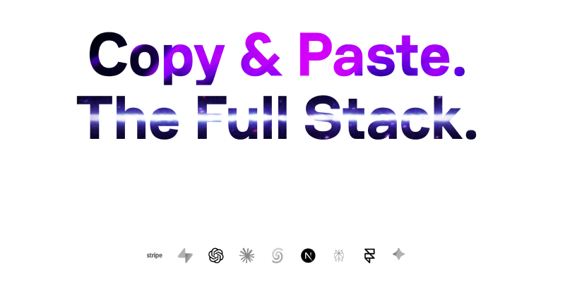

---

## AI SDK AGENTS

### 92+ AI Agent Patterns

Live interactive previews. Copy and paste what you need. Install with shadcn, download as a Next.js app, or open in v0.

#### Featured Patterns

| Preview | Pattern | Description |
| --- | --- | --- |
| 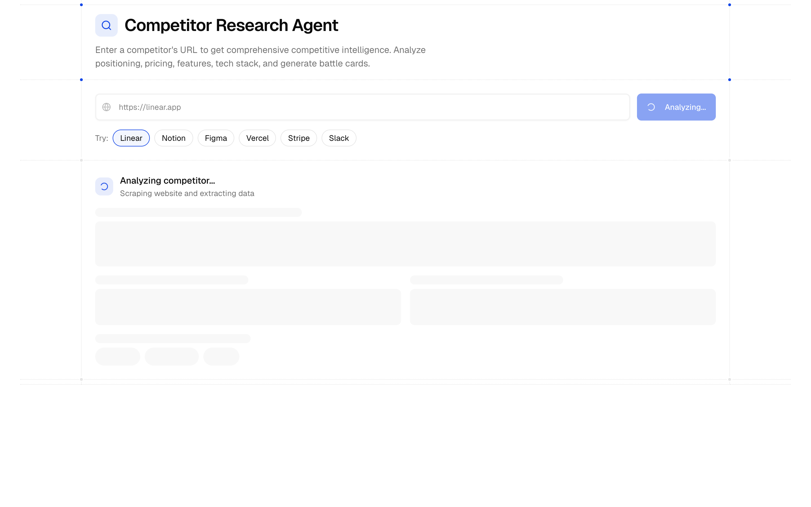 | [Competitor Research Agent](https://aisdkagents.com/directory/examples/research-agents/example-agent-competitor) | Enter a competitor URL for comprehensive competitive intelligence. Uses Firecrawl Map + Parallel Scrape for fast extraction. Analyzes positioning, pricing, features, tech stack, and generates sales battle cards. |
| 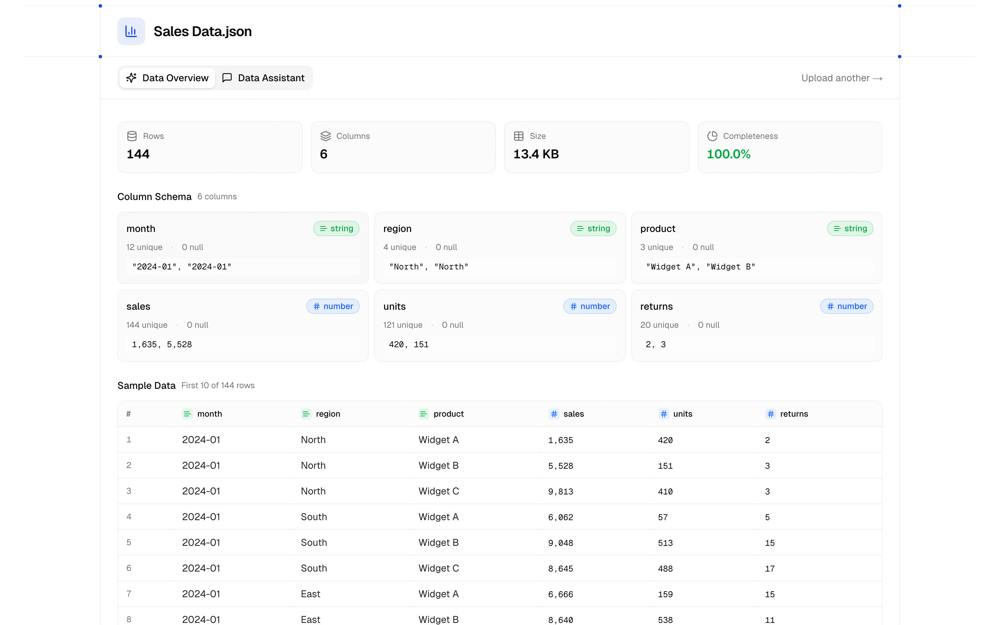 | [Data Analysis Agent](https://aisdkagents.com/directory/examples/analytics-agents/example-agent-data-analysis) | Upload CSV or JSON data and get AI-powered analysis with interactive visualizations. Detect patterns, correlations, outliers, and generate insights with confidence scores. |
| 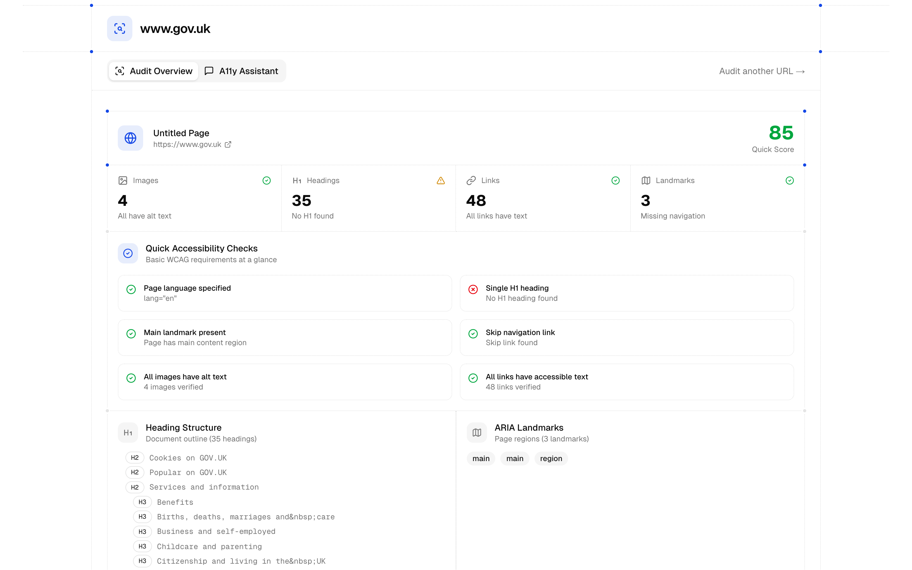 | [Accessibility Audit Agent](https://aisdkagents.com/directory/examples/audit-agents/example-agent-a11y-audit) | Audit any website for WCAG 2.1 accessibility compliance using Firecrawl, then use AI tools to analyze issues by severity, check color contrast, validate heading structure, and generate alt text. |
| 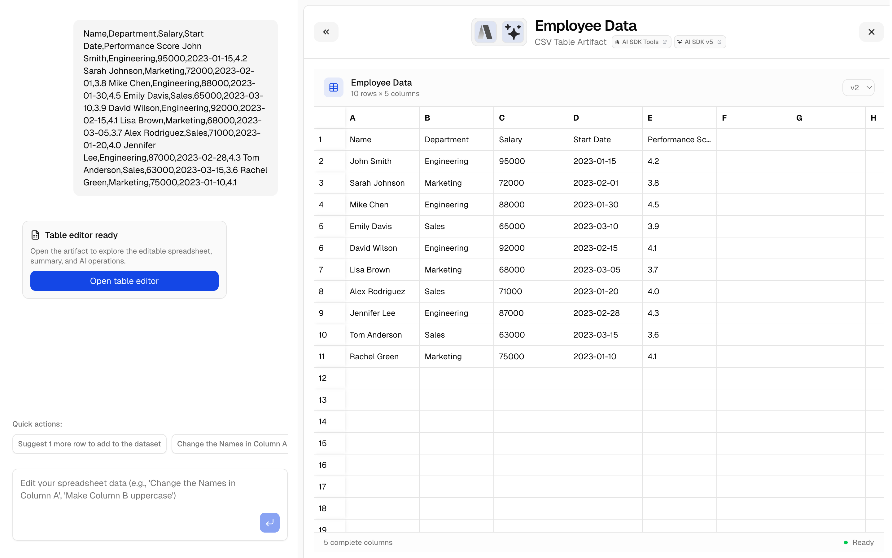 | [Table Editor Artifact](https://aisdkagents.com/directory/artifacts/interactive-artifacts/ai-artifact-table) | Spreadsheet editor with AI chat for data analysis and manipulation. Edit tables through conversation. |
| 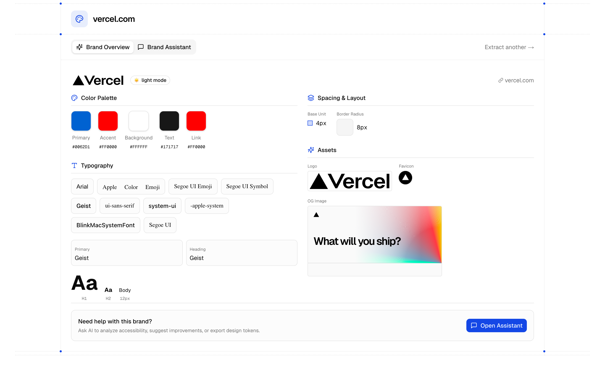 | [Branding Agent](https://aisdkagents.com/directory/examples/design-agents/example-agent-branding) | Extract brand design systems from any website using Firecrawl, then use AI tools to export tokens, generate color palettes, check accessibility, and analyze brand personality. |
| 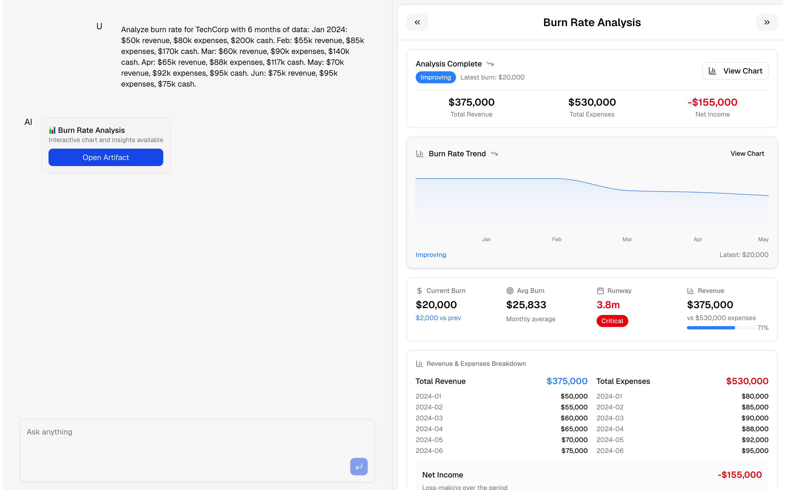 | [Chart Generation Artifact](https://aisdkagents.com/directory/artifacts/static-artifacts/ai-artifact-chart) | Generate burn rate charts and financial analysis through AI chat. Creates interactive visualizations from conversation. |

#### 4 Full-Stack Agent Templates

| Preview | Template | Description | Stack |
| --- | --- | --- | --- |
|  | [Ecommerce Multi-Agent](https://aisdkagents.com/templates/ecommerce-sub-agent-template) | Full-featured ecommerce AI assistant with multi-agent orchestration, product browsing, shopping cart management, and real-time artifact streaming. | `nextjs` `ai-sdk-tools` `typescript` `tailwind` `zustand` `framer-motion` |
| 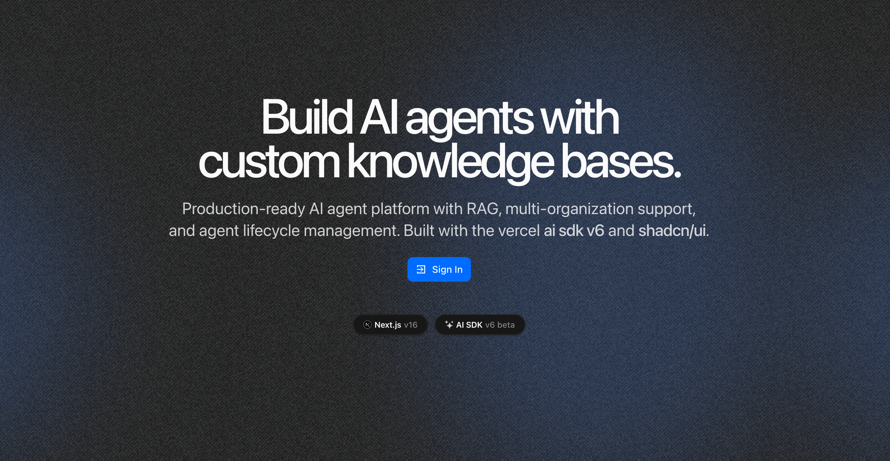 | [AI SDK Agent Platform](https://aisdkagents.com/templates/ai-agent-platform) | Build and deploy RAG agents: create, configure, and deploy AI agents with custom knowledge bases. Upload documents, scrape websites, and build vector embeddings with pgvector. | `nextjs` `workflow dev kit` `better-auth` `drizzle` `postgresql` `stripe` |
|  | [Sub Agent Starter](https://aisdkagents.com/templates/sub-agent-starter) | Hyper minimal sub agent template featuring multi-agent orchestration, tool usage, and artifact streaming with AI SDK Tools. | `nextjs` `ai-sdk-tools` `typescript` `tailwind` `shadcn` |
| 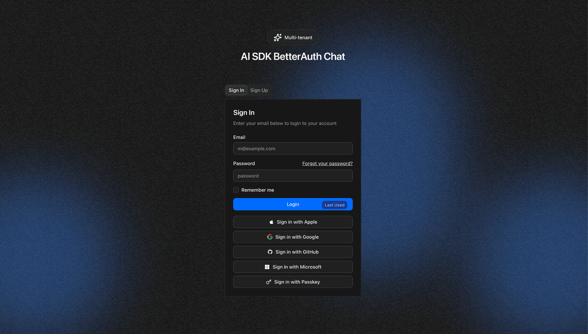 | [Multi Tenant Better Auth Chat](https://aisdkagents.com/templates/better-auth-postgres) | Full-featured ChatGPT-style SaaS chat app with multi-tenant organizations, team roles, artifact management, resumable streaming, and persistent conversation history. | `nextjs` `tailwind` `stripe` `drizzle` `resend` `better-auth` |

> **[Browse All 92 Patterns](https://aisdkagents.com/directory)**

---

## CULT PRO

### Premium Cult Blocks

Premium full-stack blocks and marketing patterns. Copy and paste into your project.

| Block | Description | Dependencies |
| --- | --- | --- |
| [Gemini Flash Image Editor](https://pro.cult-ui.com/blocks/ai-sdk-gemini-flash-image-edit) | Generate and edit images using Google's Gemini 2.5 Flash. Create new images from text or edit existing ones with natural language. Includes version history and image comparison. | `ai` `lucide-react` `@upstash/ratelimit` |
| [Agent - Multi-Step Tool Pattern](https://pro.cult-ui.com/blocks/ai-chat-agent-multi-step-tool-pattern) | AI agent that uses multiple tools in sequence. Includes web search, news search, analysis, and decision making with type safety. | `@ai-sdk/react` `ai` `@ai-sdk/openai` `zod` |
| [Agent - Evaluator-Optimizer](https://pro.cult-ui.com/blocks/ai-chat-agent-evaluator-optimizer-pattern) | AI agent that improves content quality through evaluation and optimization. Uses specialized tools to assess quality and fix issues automatically. | `@ai-sdk/react` `ai` `@ai-sdk/openai` `zod` |
| [Agent - Orchestrator Pattern](https://pro.cult-ui.com/blocks/ai-chat-agent-orchestrater-pattern) | AI agent that manages complex projects by coordinating specialized workers. Handles task assignment and tracks deliverables. | `@ai-sdk/react` `ai` `zod` |
| [Agent - Routing Pattern](https://pro.cult-ui.com/blocks/ai-chat-agent-routing-pattern) | Routes user requests to specialized AI agents. Uses AI SDK v5 streaming to classify requests and send them to the right agent for customer support. | `ai` `zod` `@upstash/ratelimit` |
| [Gemini Flash Text](https://pro.cult-ui.com/blocks/ai-sdk-gemini-flash-text) | Generates text and analyzes market research using Google's Gemini 2.5 Flash. Includes interactive charts and data visualization. | `@ai-sdk/google` `ai` `zod` `recharts` |

> **[Browse All Blocks](https://pro.cult-ui.com)**

---

## TEMPLATES

### 6 Starter Templates

Production-ready starter templates with authentication, payments, databases, and AI integrations. Ship faster with complete codebases.

| Preview | Template | Description | Stack |
| --- | --- | --- | --- |
| 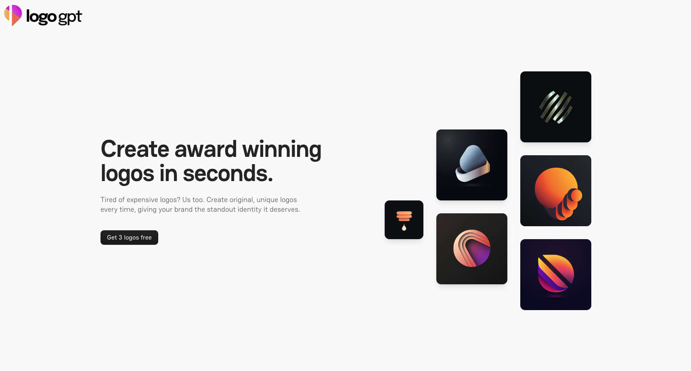 | [Logo GPT](https://pro.cult-ui.com/templates/logo-gpt-template) | AI-powered logo generation platform with Dalle integration, token-based currency system, and secure image storage using Supabase. | `nextjs` `tailwind` `openai` `supabase` |
|  | [Directory](https://pro.cult-ui.com/templates/cult-directory-template) | Automated directory platform with AI enrichment, and web scraping pipeline for rapid deployment of SEO-optimized listings. | `nextjs` `tailwind` `claudeAI` `supabase` `web-scrapers` |
|  | [Travel Stash](https://pro.cult-ui.com/templates/cult-offline-travel-stash) | Progressive web app for travel planning with offline capabilities, Claude AI integration, and real-time data synchronization across devices. | `nextjs` `tailwind` `claudeAI` `pwa` |
|  | [Landing Page](https://pro.cult-ui.com/templates/cult-landing-page) | Modern landing page template featuring Framer Motion animations, custom navigation components, and responsive design optimized for conversions. | `nextjs` `tailwind` |
|  | [Cult SEO](https://pro.cult-ui.com/templates/cult-seo) | Comprehensive SEO analysis tool with web crawling, performance testing, and AI-powered optimization recs for website improvement. | `nextjs` `tailwind` `claudeAI` `web-scrapers` |
| 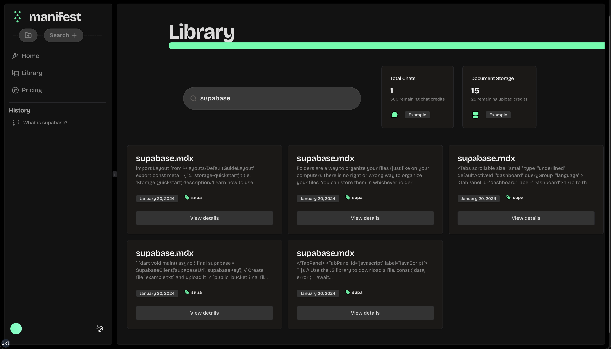 | [Manifest](https://pro.cult-ui.com/templates/manifest) | Vector embedding solution for building Perplexity-style AI applications with RAG retrieval, real-time source citations, and pgvector search functionality. | `nextjs` `tailwind` `supabase` `openai` |

> **[Browse All Templates](https://pro.cult-ui.com/templates)**

---

## ADDITIONAL GOODS

- **[Free AI Marketing](https://www.newcopy.ai)** -- An AI Cofounder that knows your brand. Start creating marketing copy that converts.
- **[Free SEO Improvement Tool](https://cleanmyseo.com)** -- Quickly evaluate your website's SEO performance for free. Open graph preview included.
- **[Full Stack Shadcn Templates](https://www.newcult.co)** -- Comprehensive Next.js + Supabase templates built with Tailwind CSS, Cult components, and shadcn.

---

## Documentation

Visit https://cult-ui.com/docs to view the documentation.

## Contributing

Please read the [contributing guide](/CONTRIBUTING.md).

## License

Licensed under the [MIT license](https://github.com/Jordan-Gilliam/ui/blob/main/LICENSE.md).
