# cult/ui

Accessible and customizable components that you can copy and paste into your apps. Free. Open Source. **Use this to build your own component library**.

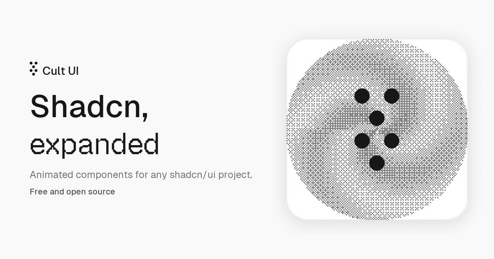

137 animated components for shadcn/ui, including 58 just added. MIT licensed, installed with one command:

```bash
npx shadcn@latest add https://cult-ui.com/r/shift-card.json
```

> **[Browse all components](https://cult-ui.com/docs/components/hero-color-panels)**

---

## AI SDK AGENTS

### 100+ AI Agent Patterns

Full-stack AI apps built with Cult UI. Live interactive previews. Copy and paste what you need. Install with shadcn, download as a Next.js app, or open in v0.

#### Featured Patterns

| Preview | Pattern | Description |
| --- | --- | --- |
| 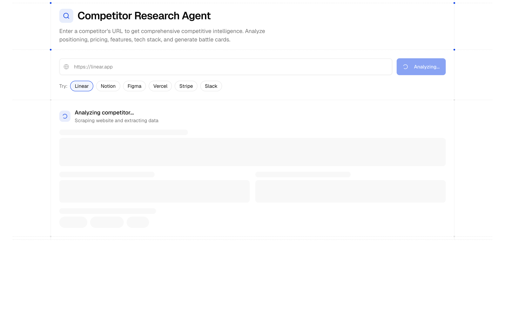 | [Competitor Research Agent](https://aisdkagents.com/directory/examples/research-agents/example-agent-competitor?utm_source=cult-ui&utm_medium=github&utm_content=readme-example-agent-competitor) | Enter a competitor URL for comprehensive competitive intelligence. Uses Firecrawl Map + Parallel Scrape for fast extraction. Analyzes positioning, pricing, features, tech stack, and generates sales battle cards. |
| 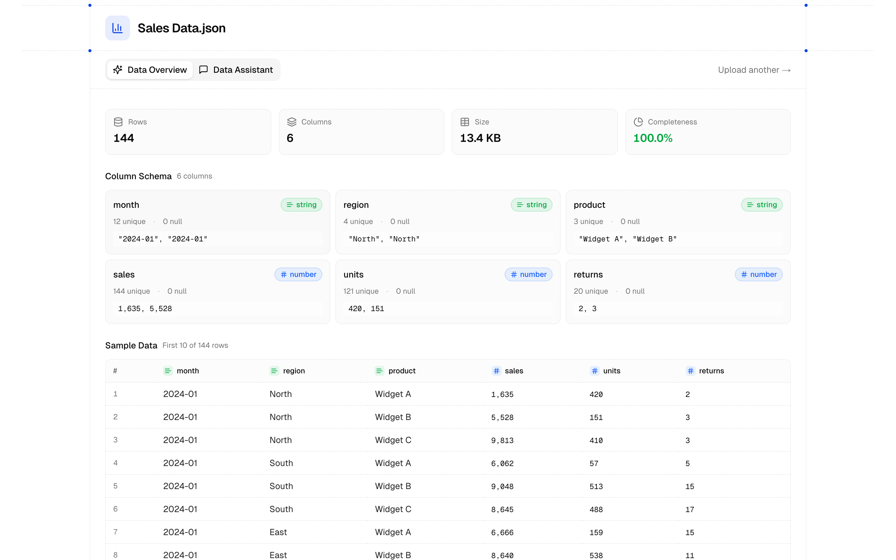 | [Data Analysis Agent](https://aisdkagents.com/directory/examples/analytics-agents/example-agent-data-analysis?utm_source=cult-ui&utm_medium=github&utm_content=readme-example-agent-data-analysis) | Upload CSV or JSON data and get AI-powered analysis with interactive visualizations. Detect patterns, correlations, outliers, and generate insights with confidence scores. |
| 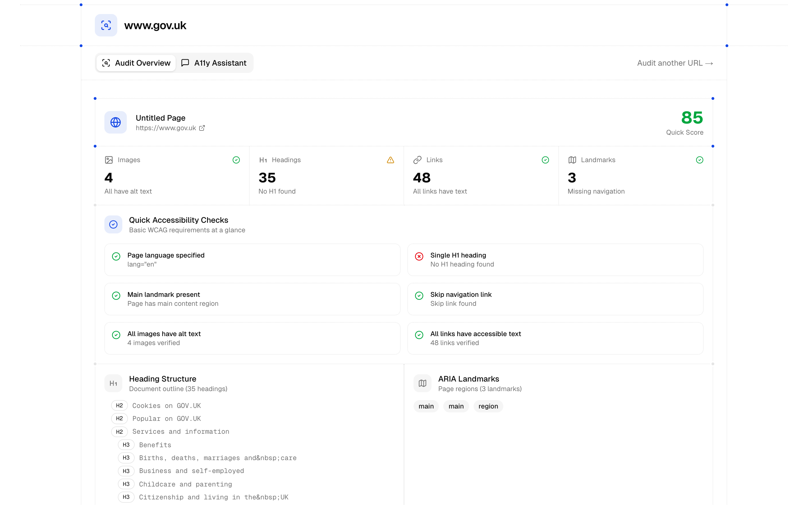 | [Accessibility Audit Agent](https://aisdkagents.com/directory/examples/audit-agents/example-agent-a11y-audit?utm_source=cult-ui&utm_medium=github&utm_content=readme-example-agent-a11y-audit) | Audit any website for WCAG 2.1 accessibility compliance using Firecrawl, then use AI tools to analyze issues by severity, check color contrast, validate heading structure, and generate alt text. |
| 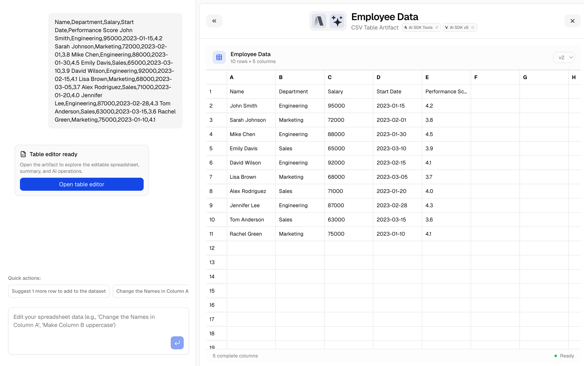 | [Table Editor Artifact](https://aisdkagents.com/directory/artifacts/interactive-artifacts/ai-artifact-table?utm_source=cult-ui&utm_medium=github&utm_content=readme-ai-artifact-table) | Spreadsheet editor with AI chat for data analysis and manipulation. Edit tables through conversation. |
| 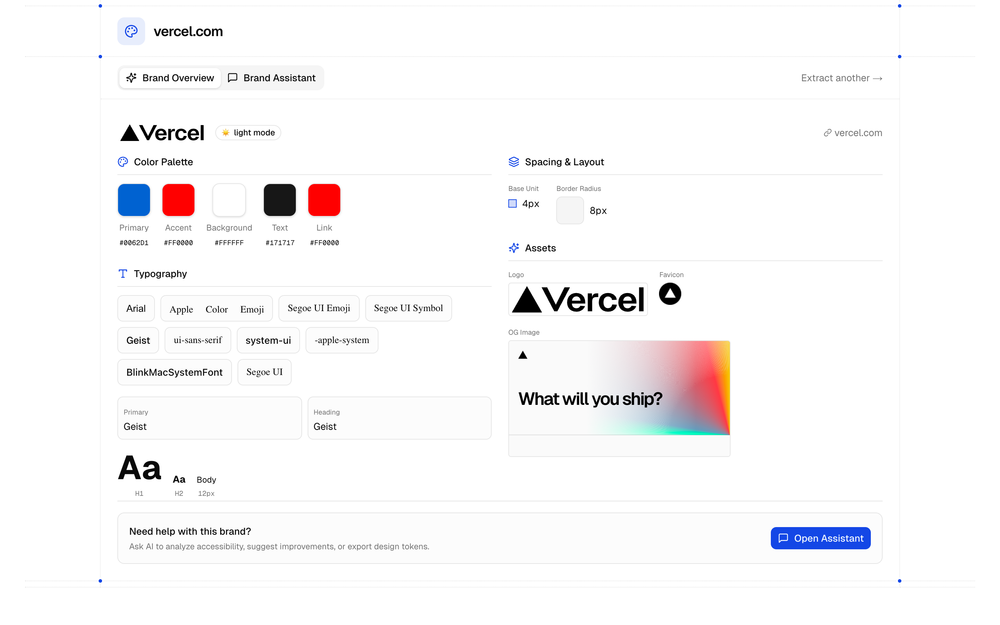 | [Branding Agent](https://aisdkagents.com/directory/examples/design-agents/example-agent-branding?utm_source=cult-ui&utm_medium=github&utm_content=readme-example-agent-branding) | Extract brand design systems from any website using Firecrawl, then use AI tools to export tokens, generate color palettes, check accessibility, and analyze brand personality. |
| 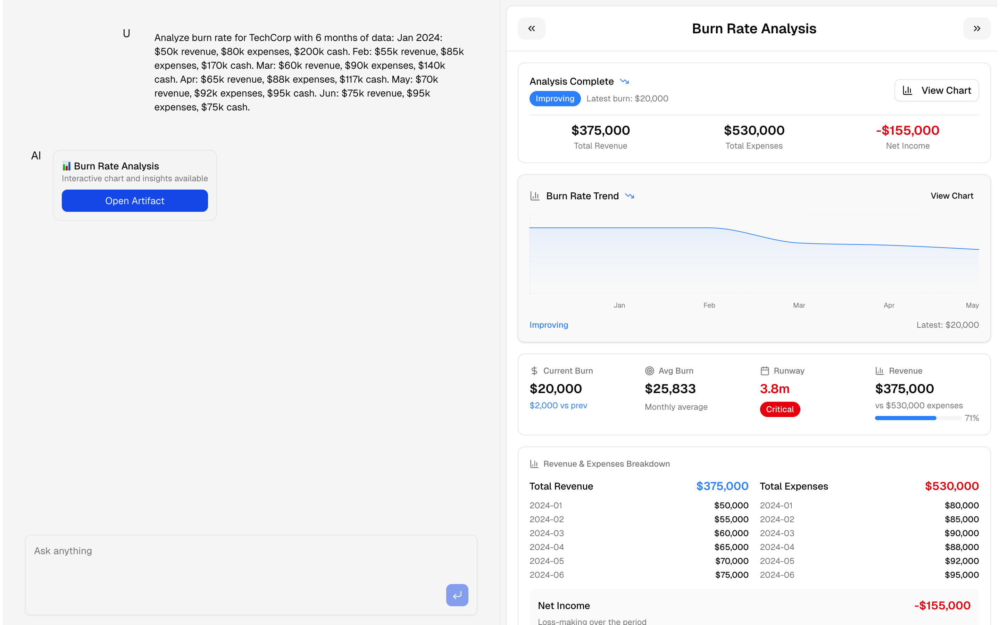 | [Chart Generation Artifact](https://aisdkagents.com/directory/artifacts/static-artifacts/ai-artifact-chart?utm_source=cult-ui&utm_medium=github&utm_content=readme-ai-artifact-chart) | Generate burn rate charts and financial analysis through AI chat. Creates interactive visualizations from conversation. |

#### 4 Full-Stack Agent Templates

| Preview | Template | Description | Stack |
| --- | --- | --- | --- |
| 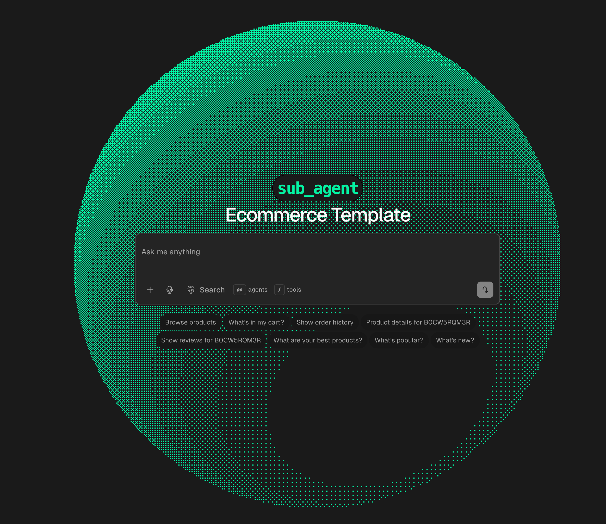 | [Ecommerce Multi-Agent](https://aisdkagents.com/templates/ecommerce-sub-agent-template?utm_source=cult-ui&utm_medium=github&utm_content=readme-ecommerce-sub-agent-template) | Full-featured ecommerce AI assistant with multi-agent orchestration, product browsing, shopping cart management, and real-time artifact streaming. | `nextjs` `ai-sdk-tools` `typescript` `tailwind` `zustand` `framer-motion` |
| 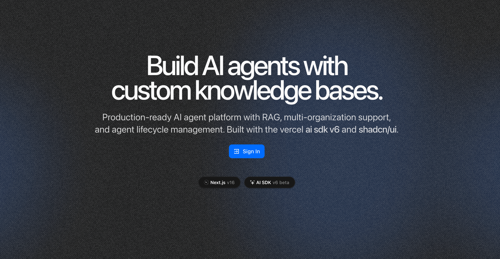 | [AI SDK Agent Platform](https://aisdkagents.com/templates/ai-agent-platform?utm_source=cult-ui&utm_medium=github&utm_content=readme-ai-agent-platform) | Build and deploy RAG agents: create, configure, and deploy AI agents with custom knowledge bases. Upload documents, scrape websites, and build vector embeddings with pgvector. | `nextjs` `workflow dev kit` `better-auth` `drizzle` `postgresql` `stripe` |
| 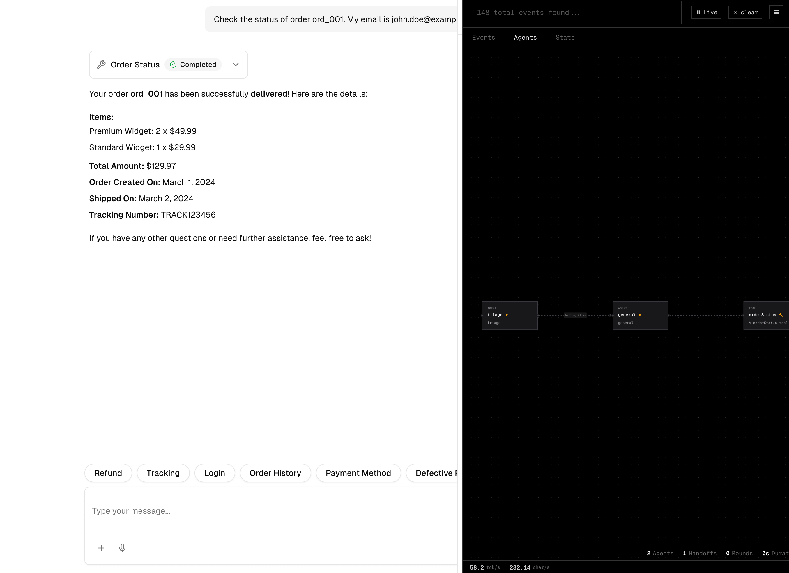 | [Sub Agent Starter](https://aisdkagents.com/templates/sub-agent-starter?utm_source=cult-ui&utm_medium=github&utm_content=readme-sub-agent-starter) | Hyper minimal sub agent template featuring multi-agent orchestration, tool usage, and artifact streaming with AI SDK Tools. | `nextjs` `ai-sdk-tools` `typescript` `tailwind` `shadcn` |
| 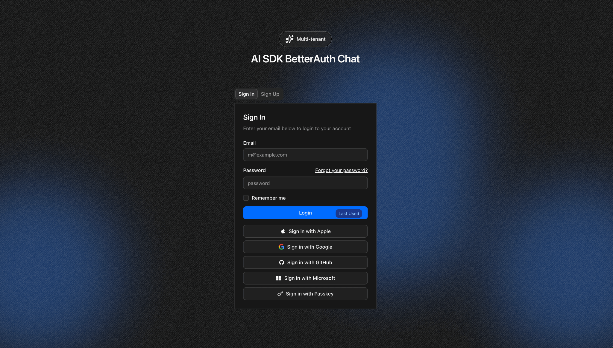 | [Multi Tenant Better Auth Chat](https://aisdkagents.com/templates/better-auth-postgres?utm_source=cult-ui&utm_medium=github&utm_content=readme-better-auth-postgres) | Full-featured ChatGPT-style SaaS chat app with multi-tenant organizations, team roles, artifact management, resumable streaming, and persistent conversation history. | `nextjs` `tailwind` `stripe` `drizzle` `resend` `better-auth` |

> **[Browse 100+ patterns](https://aisdkagents.com/directory?utm_source=cult-ui&utm_medium=github&utm_content=readme-directory)**

---

## ADDITIONAL GOODS

- **[Free AI Marketing](https://www.newcopy.ai)** -- An AI Cofounder that knows your brand. Start creating marketing copy that converts.
- **[Free SEO Improvement Tool](https://cleanmyseo.com)** -- Quickly evaluate your website's SEO performance for free. Open graph preview included.
- **[Full Stack Shadcn Templates](https://www.newcult.co)** -- Comprehensive Next.js + Supabase templates built with Tailwind CSS, Cult components, and shadcn.

---

## Documentation

Visit https://cult-ui.com/docs to view the documentation.

## Contributing

Please read the [contributing guide](/CONTRIBUTING.md).

## License

Licensed under the [MIT license](https://github.com/Jordan-Gilliam/ui/blob/main/LICENSE.md).
